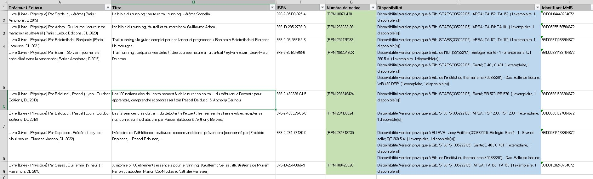
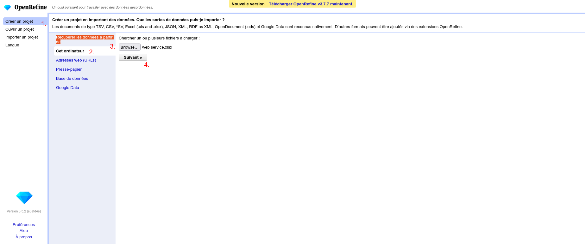
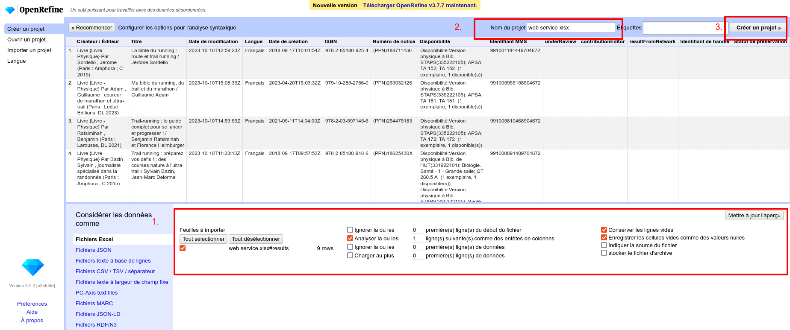
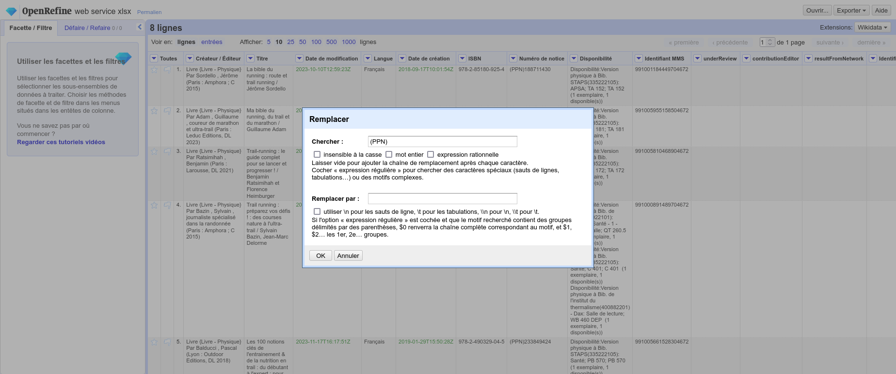
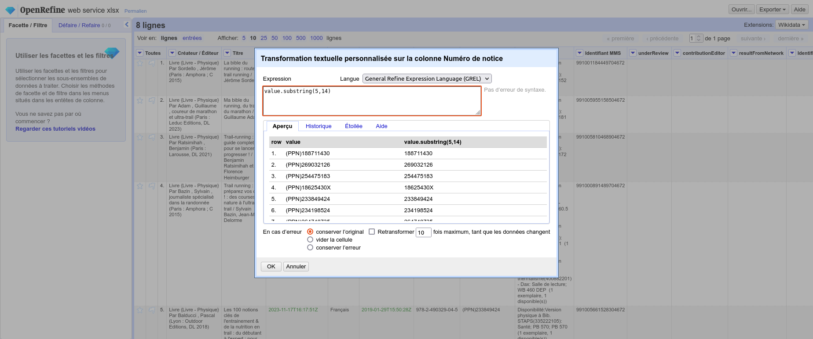
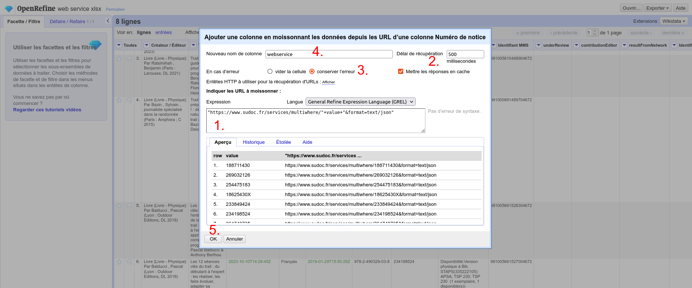
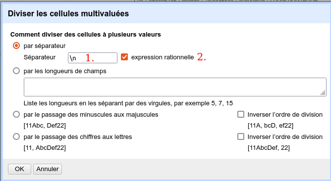
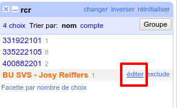

# Cas pratique 2 : utiliser le web service "multiwhere" de l'ABES pour s'assurer que les notices locales sont bien synchronisées avec le SUDOC.

À partir d'une liste de titre et leur localisation extraite de notre SGB nous voudrions nous assurer que chaque localisation existe bien dans le SUDOC.

 Pour réaliser cette opération, nous allons utiliser [le web service multiwhere](https://documentation.abes.fr/sudoc/manuels/administration/aidewebservices/index.html#multiwhere). Ce web service prend en paramètre un ou plusieurs PPN et fournie en réponse la liste des RCR localisés sous la notice.
Ainsi nous allons, pour chaque titre présent dans notre fichier appeler le web service de l'ABES pour obtenir la liste des rcr localisés sous la notice. Nous allons ensuite extraire chaque bibliothèque Alma présente dans la colonne *Disponibilité* pour la transformer en RCR.
Nous nous assurerons ensuite que le RCR de chaque localisation est bien présent dans cette liste retournée par le SUDOC.
## 1 Construction des urls et obtention de la liste des rcr localisés sous la notice
### 1.1 Import du fichier dans Open Refine
1.1.1 Téléchargez le fichier [fichier_source_cas_pratique_2.xlsx](fichier_source_cas_pratique_2.xlsx).
1.1.2 Ouvrez Open Refine
1.1.3 Créer un projet (1.)> Récupérer les données à partir de cet ordinateur (2.) > Browse (3.) > Suivant >>(4.)

Si nécessaire, ajustez les options d'importation (1. )
Renommez vore projet (2.)
Créez le projet (3.)

### 1.2 Nettoyage du PPN
Regardez le contenu de la colonne *Numéro de notice*. Notre PPN est préfixé par la chaîne de caractère "(PPN)". Nous allons devoir nettoyer notre champ sinon le web service de l'ABES ne reconnaitra pas notre identifiant. Pour ce faire, il existe plusieurs méthodes. En voici quelques-unes. 
#### 1.2.1 En utilsant la fonction remplacer
Sous la colonne *Numéro de notice*, allez dans ``Editer les cellules`` et cliquez sur ``Remplacer``.

Remplacez simplement la chaîne *"(PPN)"* par une chaîne vide. Laissez vide le champ ``Remplacer par :`` 
#### 1.2.3 En transformant les données
Sous la colonne *Numéro de notice*, allez dans ``Editer les cellules`` et cliquez sur ``Transformer...``

Nous pouvons utiliser plusieurs formules pour nettoyer notre PPN.
> 💡 **Astuce :** Aidez-vous de l'aperçu pour voir en temps réel l'effet de votre formule. 
##### Substring
``value.substring(5,14)``
Extrait les caractères de la chaîne *value* entre les positions 5 et 14 (Attention, la numérotation commence à 0 ). Si le deuxième paramètre est absent, extrait les éléments de jusqu’au dernier. Dans notre cas ``value.substring(5)`` permet d'obtenir le même résultat.
##### Replace
``value.replace("(PPN)","")``
Dans la chaîne value, remplace la chaîne "(PPN)" par la une chaîne vide. Il est possible d'utiliser une expression régulière. Elle doit être encadrée par *//*.
Exemple : ``value.replace(/^.{5}/,"")`` --> Remplace les 5 premiers caractères de la chaîne par une chaîne vide.
##### Slice
La chaîne de caractère est considérée comme une liste de caractère. Ainsi on peut exprimer la valeur de notre colonne ainsi : [(,P,P,N,),1,8,6,2,5,4,3,0,X].
Chaque caractère va avoir une position dans la liste.
```
[(,P,P,N,),1,8,6,2,5, 4, 3, 0, X]
 0 1 2 3 4 5 6 7 8 9 10  11 12 13
```
Vi la formule, ``value[5,14]``, on extrait les valeurs de la position 5 à 14. L'extraction s'arrête juste avant la 14ème position.

### 1.3 Construction de l'URL et appel du web service
Nou allons maintenant construire l'URL pour chaque PPN et appeler le web service multiwhere. Regardons [la documentation du web service multiwhere](https://documentation.abes.fr/sudoc/manuels/administration/aidewebservices/index.html#multiwhere). L'adresse doit être construite ainsi :
```
https://www.sudoc.fr/services/multiwhere/[PPN]&format=text/json
```
Le dernier paramètre de l'URL (*format*) indique que nous voulons recevoir les résultats [au format json](https://fr.wikipedia.org/wiki/JavaScript_Object_Notation).
> 💡 La plupart des webservice fournissent les données au format xml ou json. Dans Open Refine nous vous conseillons de privilégier le deuxième format beaucoup plus facile à manipuler.

  1.3.1 À partir de la colonne *numéro de notice*, cliquez sur ``Editer la colonne>Ajouter la colonne en moissonnant des urls``. Un nouvel écran apparait.

  1.3.2 Dans la zone de saisie de l'expression (1.), construisez l'url en concaténant le PPN présent dans la colonne *numéro de notice* (obtenu via le paramètre *value*) avec les autres éléments de l'URL.
```
"https://www.sudoc.fr/services/multiwhere/"+value+"&format=text/json"
```
>💡**Rappel** Les chaînes de caractères doivent être encadrées par des ' ou des "

>💡**Rappel** le paramètre **value** permet d'obtenir les valeurs des cellules de la colonne en cours de transformation. Pour appeler les valeurs des cellules des colonnes voisines, utilisez l'expression suivante **cells[nom de la colonne].value**

  1.3.3 Modifiez le délai de récupération (2.) à 500 millisecondes
  1.3.4 En cas d'erreur, choisissez de *conserver l'erreur* (4.) 
  1.3.5 Nommez la colonne *réponse web service* (4.) et validez (5.). 
>**⚠ Atention :** Pour chaque ligne du projet, Open refine va appeler le web service de l'ABES. Ce traitement peut prendre plus ou moins de temps selon la taille du fichier à traiter.

## 2. Extraction des localisations Alma et transformation en RCR 

### 2.1 Envoyer chaque localisation sur une ligne unique

Si vous regardez la cellule disponibilité vous remarquez que chaque mention de disponibilité est séparée par un saut de ligne.
>💡 **Rappel :** En expression régulière le saut de ligne est représenté ainsi **\n**

À partir de la colonne *Disponibilité*, allez dans ``Editer les cellules>Diviser les cellules multivaluées``

Indiquez comme séparateur **\n** (1.) et indiquez qu'il s'agit d'une expression rationnelle (2.). Validez.
>💡**A noter :** regarder le nombre de lignes (en haut à gauche de l'écran de projet), il est passé de 8 à 12. Passez maintenant en mode entrées. Notez que nous avons toujours 8 entrées.

Regardez la construction du champ disponibilité (Vous pouvez pour cela vous aider des facettes). Le motif de construction du champ est toujours le même.
```
Disponibilité:Version physique à [BIBLIOTHEQUE] : [LOACALISATION]; [COTE HOLDING]; [COTE EXEMPLAIRE]  ([DISPONIBILITE])
```
La bibliothèque est toujours précédée de la chaîne de caractère "Disponibilité:Version physique à " et suivie " :" qui introduit le reste des informations. Voici une des stratégies possibles pour extraire la bibliothèque :

- On supprime la chaîne "Disponibilité:Version physique à "
- On extrait ensuite la chaîne de caractères située devant " :"
À partir de la colonne disponibilité, cliquez sur ``Editer la colonne>Ajouter une colonne en fonction de cette colonne``.

Dans l'écran de saisie des expressions, saisissez la formule suivante :

```
value.replace("Disponibilité:Version physique à ","").split(" :")[0]
```
On remplace dans un premier temps la chaîne "Disponibilité:Version physique à " par une chaîne vide puis on utilise la fonction split qui va séparer notre chaîne sur la base de " :" en plusieurs chaînes de caractère. On prend alors la première chaîne ([0]).
Nommez la colonne *rcr* et validez.

### 2.3 Remplacer le nom de la bibliothèque par le RCR

À partir de la colonne rcr, cliquez sur ``facette>facette textuelle``. Vous pouvez alors à partir de la facette éditer chaque entrée pour la remplacer par le rcr.


| Lib. Bib. Alma | RCR |
| :--------------- |:---------------:|
| Bib. STAPS  |335222105 |
|Bib. de l'institut du thermalisme  - Dax |400882201 |
|Bib. de l'IUT |331922101 |
|BU SVS - Josy Reiffers |330632101 |

Supprimer la facette

## 3. Analyse de la réponse du web service

### 3.1 Recopier la réponse du web service sur toutes les lignes

3.1.2 Positionnez-vous en mode d'affichage **lignes** (en haut à gauche de l'espace de travail)
3.1.3 À partir de la colonne *réponse web service*, cliquez sur ``Èditer les cellules>Recopier les valeurs dans les cellules vides consécutives``

### 3.2 Voir si dans la réponse du web service le rcr de la colonne *rcr* existe

3.2.1 À partir de la colonne *réponse web service*, cliquez sur ``Editer la colonne>Ajouter une colonne en fonction de cette colonne``.

3.2.2 Saisissez la formule suivante
```
filter(value.parseJson()["sudoc"]["query"]["result"]["library"],bib,bib["rcr"]==cells["rcr"].value)[0]["shortname"]
```
Nommez votre colonne et validez.
Cette formule parcourt la liste des RCR. Si un RCR correspond au RCR présent dans la colonne RCR, elle retourne le nom de la bibliothèque dans le SUDOC.
3.2.3 Repérer les localisations non présentes dans le SUDOC.
À partir de la colonne nouvellement créée faites une facette pour repérer les cellules vides : ``Facette>Facette personnalisée>Facette par valeur vide (valeure nulle ou chaîne vide)``.
La facette true vous permettra d'identifier les cas où la localisation dans le SUDOC est absente.


